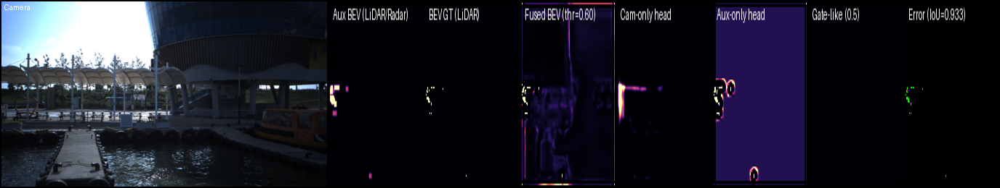
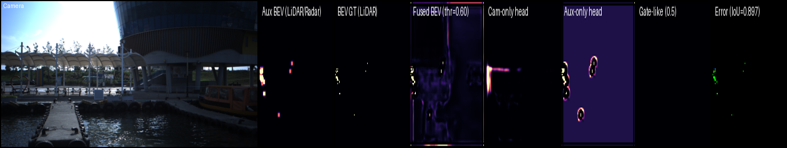
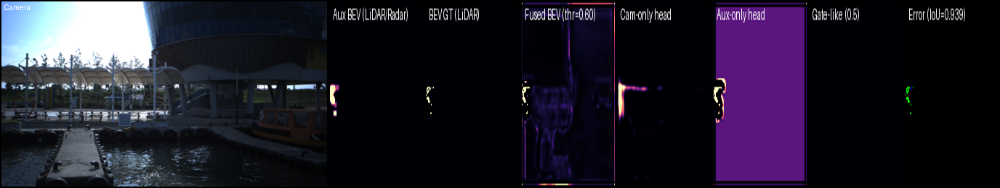
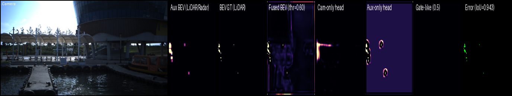

<div align="center">
  <table border=0 style="border: 0px solid #c6c6c6 !important; border-spacing: 0px; width: auto !important;">
    <tr>
      <td valign=top style="border: 0px solid #c6c6c6 !important; padding: 0px !important;">
        <div align=center valign=top>
          
        </div>
      </td>
    </tr>
  </table>
</div>

---

A practical, calibration-lean BEV fusion pipeline for maritime scenes.
It time-aligns monocular RGB with forward LiDAR, rasterizes points into BEV, and trains a compact fusion head for occupancy/obstacle likelihood over water.

Latest validation(e.g. N = 4): Fusion mIoU 0.93 / 0.90 / 0.94 / 0.94 per panel at thr=0.60 (qualitative set), and mIoU 0.837 @ best_thr 0.95 from metrics.json. Best sweep epoch: mIoU 0.866 @ thr 0.75 with Recall ≈ 0.992 and strong ROC-AUC.


- [Installation](#installation)
- [Usage](#usage)
- [Project Overview](#Project_Overview)
- [Resource Management for CPU and GPU Allocation](Resource_Management_for_CPU_and_GPU_Allocation)
- [Modular and Configuration](#Modular_and_Configuration)
- [License](#license)
- [Summary of Analysis of Model Performance](#Summary_of_Analysis_of_Model_Performance)


# Installation

### Prerequisites

Python 3.9+

PyTorch (CUDA optional)

OpenCV, NumPy, SciPy, Matplotlib

(Optional) cuDNN/CUDA for GPU acceleration

### Setup
```bash
git clone https://github.com/<your-org-or-user>/<repo-name>.git
cd <repo-name>
python -m venv .venv && source .venv/bin/activate
pip install -r requirements.txt
```
# Quick Start

1. Create image–LiDAR pairs (timestamps within ±800 ms):

```bash
python scripts/make_maritime_pairs.py \
  --img_dir ./datasets/nuscenes_toy/images \
  --lidar_dir ~/data/.../lidar_front/points \
  --out_csv datasets/maritime_pairs.csv \
  --max_ms 800 \
  --write_npy --npy_dir datasets/nuscenes_toy/lidar \
  --unit_scale 1.0 --swap_xy --flip_x
```

2. Train + validate:

```bash
python -m src.train \
  --root ./datasets \
  --out ./outputs/rebalanced_fusion \
  --epochs 50 --batch 4
```

3. Evaluate & export metrics (sweeps threshold to find best_thr):

```bash
python -m src.eval \
  --root ./datasets \
  --ckpt ./outputs/rebalanced_fusion/checkpoints/last.pt \
  --out ./outputs/rebalanced_fusion
```

# Project Overview

The aim of this project is to deliver reliable obstacle and occupancy estimates in challenging maritime scenes, where RGB alone lacks depth cues and LiDAR can be sparse or reflective. We address this by fusing both modalities directly in bird’s-eye view (BEV): image features are lifted into BEV and concatenated with a LiDAR hit histogram, then a lightweight decoder produces fused logits. The workflow runs without precise extrinsics—by default it uses adaptive BEV lifting and, when a calib.json is available, can switch to geometrically grounded voxel lifting for tighter alignment. The data pipeline is deliberately deterministic: image–LiDAR pairing is reproducible, the raster window is fixed, and transforms like swap_xy and flip_x are explicit. To keep iteration fast, configuration lives in a single file and common actions (pairing, training, evaluation, visualization) are scripted, with all artifacts written under outputs/<run> for clean tracking and comparison.


# Project Structure


# Configuration (base.yaml)
```python

# conf/base.yaml
paths:
  root: ./datasets
  out: ./outputs/rebalanced_fusion
  pairs_csv: datasets/maritime_pairs.csv

image:
  h: 256
  w: 448

bev:
  h: 128
  w: 128
  meters_x: 40      # forward
  meters_y: 30      # lateral
  z_min: -3
  z_max: 3
  swap_xy: true
  flip_x: true

raster:
  norm: log1p       # histogram normalization
  blur_ksize: 3     # viz only
  dilate_ks: 3      # viz only

model:
  backbone: simplebev_xs
  lifted: adaptive   # [adaptive|voxel]
  heads: [fusion, cam_only, aux_only]

train:
  epochs: 50
  batch_size: 4
  lr: 5.0e-4
  weight_decay: 1.0e-2
  amp: true

eval:
  thr_sweep: true
  thr_default: 0.60

viz:
  fov_deg: 120
  p_low: 0.5
  p_high: 99.5
  gamma: 0.6
  colormap: true
```

# Data & Preprocessing

RGB: ./datasets/nuscenes_toy/images

LiDAR: ~/data/.../lidar_front/points/*.bin → raster .npy at ./datasets/nuscenes_toy/lidar

Pairs CSV: datasets/maritime_pairs.csv

Time Alignment

Filenames carry ns timestamps; align RGB↔LiDAR using constant offset with tolerance ±800 ms.

Current experiments use an 80/20 split with N=4 validation frames (matches metric counts).

BEV Rasterization

Fixed forward window 40 m × 30 m, height band [−3, 3] m.

Accumulate hits per cell; log(1+x) normalization.

Feature lifting:

Adaptive pooling by default (no extrinsics required).

Voxel lifting when calib.json is provided.


# Model

| Layer / Block                 |                       Input Shape |         Output Shape |    Kernel | Stride | Padding | Additional Info                                                                     |
| ----------------------------- | --------------------------------: | -------------------: | --------: | -----: | ------- | ----------------------------------------------------------------------------------- |
| **RGB Input**                 |                      (B, 3, H, W) |                    — |         — |      — | —       | Monocular camera frame                                                              |
| Conv2D + ReLU                 |                      (B, 3, H, W) |    (B, 32, H/2, W/2) |       3×3 |      2 | 1       | Backbone stage 1                                                                    |
| Conv2D + ReLU                 |                 (B, 32, H/2, W/2) |    (B, 64, H/4, W/4) |       3×3 |      2 | 1       | Backbone stage 2                                                                    |
| Conv2D + ReLU                 |                 (B, 64, H/4, W/4) |    (B, 96, H/8, W/8) |       3×3 |      2 | 1       | Backbone stage 3                                                                    |
| Conv2D + ReLU                 |                 (B, 96, H/8, W/8) | (B, 128, H/16, W/16) |       3×3 |      2 | 1       | Backbone stage 4                                                                    |
| **Parameter-Free Lifter**     |              (B, 128, H/16, W/16) |     (B, 128, Hb, Wb) |         — |      — | —       | Voxel-centric bilinear sampling to BEV (falls back to adaptive pooling if no calib) |
| Conv2D + ReLU (compress\_cam) |                  (B, 128, Hb, Wb) |      (B, 32, Hb, Wb) |       3×3 |      1 | 1       | Camera BEV compression                                                              |
| **BEVResBlock ×2**            |                   (B, 32, Hb, Wb) |      (B, 32, Hb, Wb) |       3×3 |      1 | 1       | Each: Conv→BN→ReLU→Conv→BN + residual; ReLU                                         |
| **Cam-only Head**             |                   (B, 32, Hb, Wb) |       (B, 1, Hb, Wb) | 3×3 → 1×1 |      1 | 1 / 0   | Conv(32→16)+ReLU, Conv(16→1); **logits**                                            |
| **LiDAR BEV Input**           |                    (B, 1, Hb, Wb) |                    — |         — |      — | —       | 1-ch histogram from rasterizer                                                      |
| Conv2D + ReLU (compress\_aux) |                    (B, 1, Hb, Wb) |      (B, 32, Hb, Wb) |       3×3 |      1 | 1       | Aux (LiDAR) compression                                                             |
| **BEVResBlock ×1**            |                   (B, 32, Hb, Wb) |      (B, 32, Hb, Wb) |       3×3 |      1 | 1       | Residual block                                                                      |
| **Aux-only Head**             |                   (B, 32, Hb, Wb) |       (B, 1, Hb, Wb) | 3×3 → 1×1 |      1 | 1 / 0   | Conv(32→16)+ReLU, Conv(16→1); **logits**                                            |
| **Concat (Fusion)**           | (B, 32, Hb, Wb) ⊕ (B, 32, Hb, Wb) |      (B, 64, Hb, Wb) |         — |      — | —       | Channel-wise concat of cam & aux features                                           |
| **BEVResBlock ×2**            |                   (B, 64, Hb, Wb) |      (B, 64, Hb, Wb) |       3×3 |      1 | 1       | Fusion trunk                                                                        |
| **Fused Head**                |                   (B, 64, Hb, Wb) |       (B, 1, Hb, Wb) | 3×3 → 1×1 |      1 | 1 / 0   | Conv(64→32)+ReLU, Conv(32→1); **logits**                                            |
| Gate-like Map (viz)           |                                 — |       (B, 1, Hb, Wb) |         — |      — | —       | Constant 0.5 (visualization only)                                                   |


# Resource Management (CPU/GPU)

The trainer accepts Flower-style resource keys for consistency with your FL projects:
```python
# inside src/train.py
client_resources = {'num_cpus': 1, 'num_gpus': 0.0}  # set 0.2 to share a GPU
```
Set num_gpus to a fractional value (e.g., 0.2) to time-share a single GPU across multiple workers—useful when iterating on configs quickly. (Mirrors your resource notation so teams see a uniform pattern across repos. )

# Results

Summary from metrics.json (saved checkpoint):

```bash
outputs/rebalanced_fusion/metrics.json
best_thr: 0.95
```
| Head   | mIoU       | IoU\_micro | Precision | Recall  | ROC\_AUC | Latency (ms) | TP  | FP | FN |
| ------ | ---------- | ---------- | --------- | ------- | -------- | ------------ | --- | -- | -- |
| Fusion | **0.8370** | 0.8367     | 0.8425    | 0.9919  | 0.9956   | 267.0        | 123 | 23 | 1  |
| Camera | 0.2922     | 0.2905     | 0.6418    | 0.3468  | 0.9901   | 334.0        | 43  | 24 | 81 |
| Aux    | 0.5563     | 0.5561     | 0.5561    | ≈1.0000 | 0.9997   | 267.0        | 124 | 99 | 0  |


Best epoch across the sweep (internal log):

Fusion mIoU 0.866 @ thr 0.75, Recall ≈ 0.992, latency ≈ 237 ms.

### Qualitative Examples

## Qualitative Results (Validation Panels)

| Panel 0 | Panel 1 |
|---|---|
| <a href="outputs/rebalanced_fusion/viz/val_00_panel.png"></a> | <a href="outputs/rebalanced_fusion/viz/val_01_panel.png"></a> |

| Panel 2 | Panel 3 |
|---|---|
| <a href="outputs/rebalanced_fusion/viz/val_02_panel.png"></a> | <a href="outputs/rebalanced_fusion/viz/val_03_panel.png"></a> |


___________________

## Qualitative Results (Validation Panels)

<p align="center">
  <br/>
  <br/>
  <br/>
  
</p>


## License
This project is licensed under the [MIT License](https://opensource.org/licenses/MIT). Please refer to the [LICENSE](LICENSE) file for more details.


